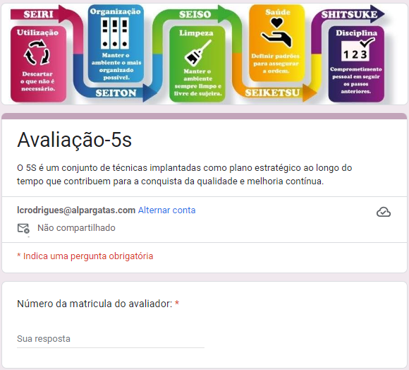
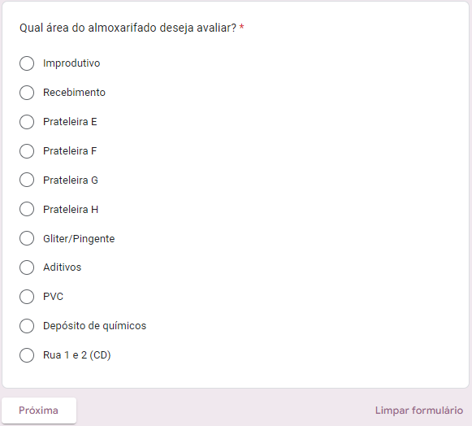

# 5S
Ferramenta de monitoramento dos critérios da filosofia do 5S

## Página inicial:

## Avaliação da área:

---

## Fluxo de monitoramento
- A ferramenta utiliza como tecnologias o Google forms para a captação dos dados e o google sheets  para definição dos críterios de atualziação das infromações.
- A planilha esta estruturada para atualizar a avaliação das semanas considerando o número da semana.
- Após a identificação da semana, serão considerados o número de respostas e considerando como hierarquia de avaliação **Ruim > Regular > Bom**  em casos de impates nas respostas. 
